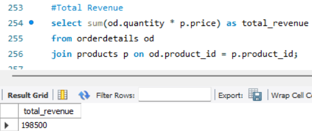
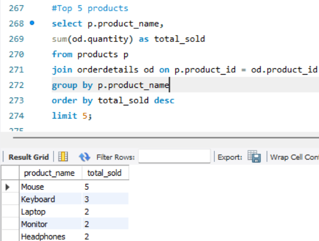
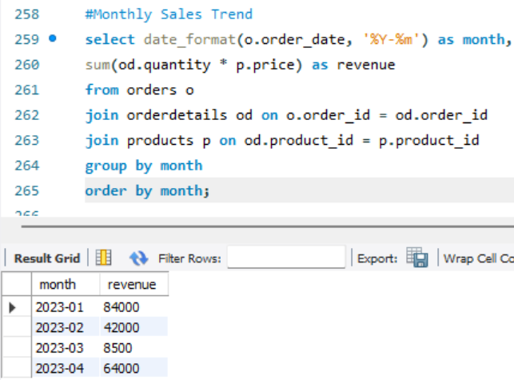

# 🗄️ Retail Sales & Customer Analytics using SQL

## 📌 Project Overview

This project analyzes retail sales data using SQL to generate business insights such as revenue trends, customer behavior, and product performance.

## 🛠 Tools & Technologies

* MySQL

## 🧩 Database Tables

* Customers
* Products
* Orders
* Order Details
* Employees

## 🔍 Key Analysis Performed

* Total Revenue Calculation
* Monthly Sales Trend Analysis
* Top-Selling Products
* Customer Purchase Behavior
* Employee Performance Tracking

## 🧠 SQL Concepts Used

* Joins (Inner, Left Join)
* Aggregations (SUM, COUNT, AVG)
* Subqueries
* CTE (Common Table Expressions)
* Window Functions (RANK, Running Total)

## 📁 Project Structure

* `schema.sql` → Table creation
* `data.sql` → Sample data
* `queries.sql` → Analysis queries

## 📷 Sample Outputs

## 🚀 Key Insights

* Electronics category generated highest revenue
* Identified top customers based on spending
* Sales trends show growth across months

## 🎯 Conclusion

This project demonstrates strong SQL skills including data modeling, querying, and extracting actionable business insights.
